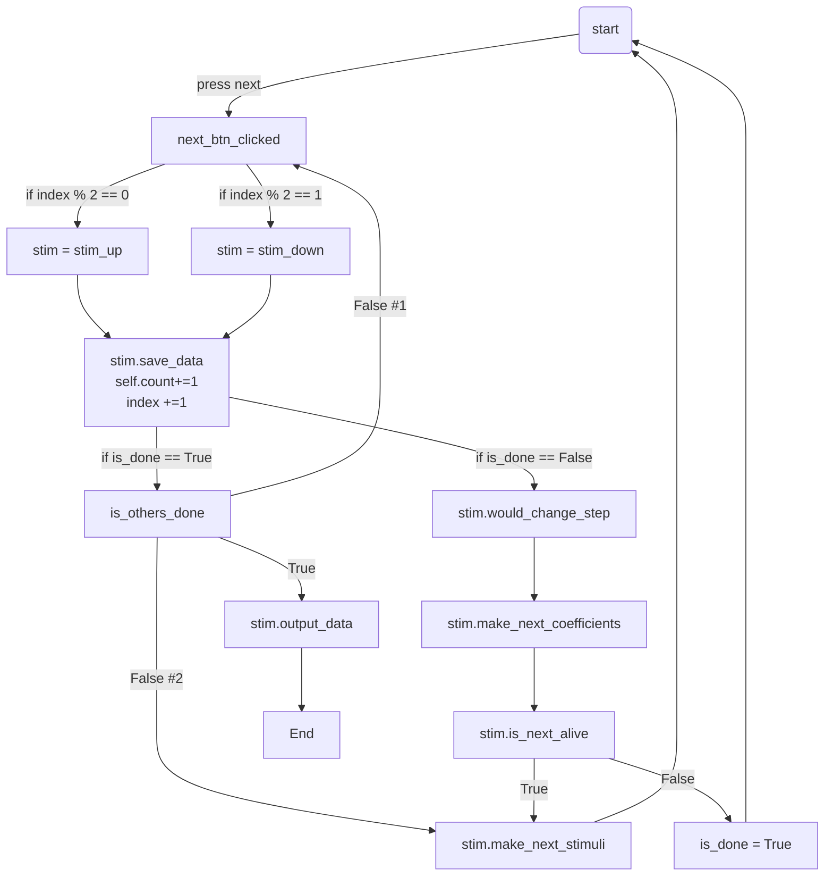

# test01 Flow Chart

```mermaid
graph
start(start) --> |press next| A[next_btn_clicked]
A --> |if index % 2 == 0| B[stim = stim_up]
A --> |if index % 2 == 1| C[stim = stim_down]

B --> Ab[stim.save_data \n self.count+=1 \n index +=1]
C --> Ab
Ab --> |if is_done == False| D[stim.would_change_step]
D --> Ds
Ab --> |if is_done == True| G[is_others_done]
G --> |True| H[stim.output_data]
G --> |False #1| A
G --> |False #2| E

Ds[stim.make_next_coefficients] --> dc[stim.is_next_alive]

dc --> |True| E[stim.make_next_stimuli]
dc --> |False| F[is_done = True]
F --> start
E --> start

H --> End
```
